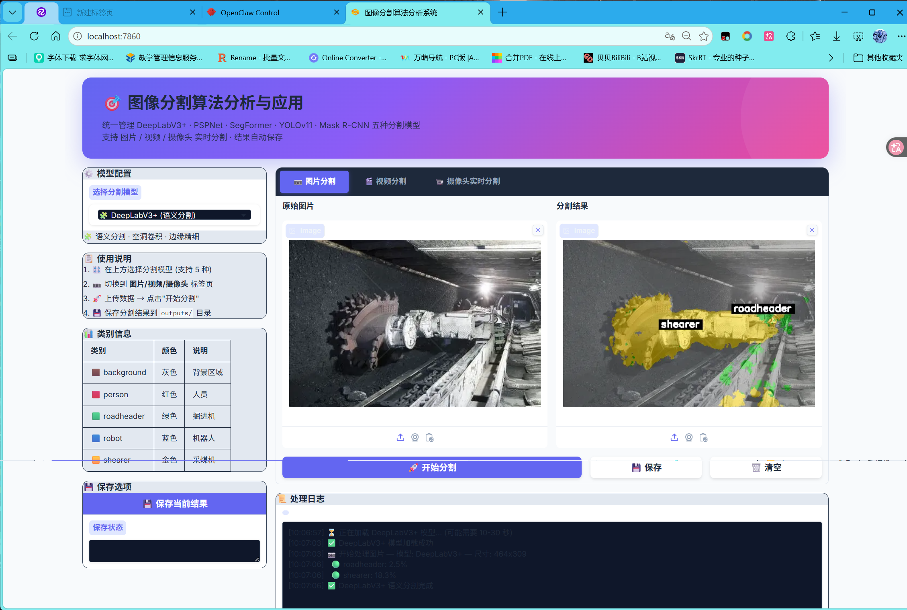
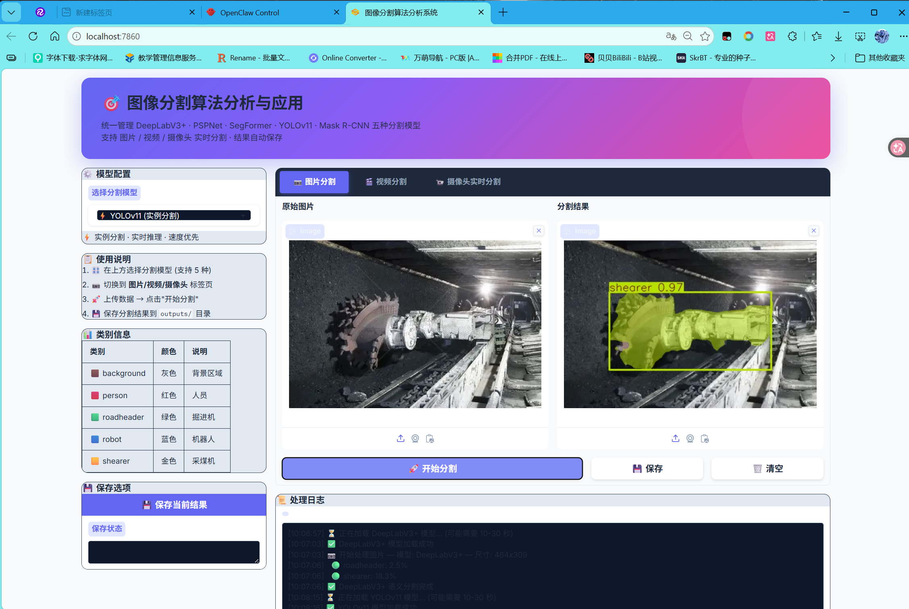

# 🎯 图像分割算法分析与应用

> **本科毕业设计** — 基于深度学习的主流图像分割算法对比分析与应用实现  
> 以**煤矿井下场景**为背景，对**人、掘进机、采煤机、巡检机器人**等多类目标进行分割检测

---

## 🧭 项目简介

本毕业设计系统性地研究并实现了当前主流的图像分割算法，涵盖**语义分割**与**实例分割**两大方向，并提供统一 Web 界面进行对比演示。

### 支持模型（5 种）

| 模型 | 类型 | 框架 | 特点 |
|------|------|------|------|
| **DeepLabV3+** | 🧩 语义分割 | MMSegmentation | 空洞卷积，边缘精细 |
| **PSPNet** | 🏗️ 语义分割 | MMSegmentation | 金字塔池化，场景理解好 |
| **SegFormer** | 🤖 语义分割 | MMSegmentation | Transformer 架构，SOTA 精度 |
| **YOLOv11** | ⚡ 实例分割 | Ultralytics | 实时推理，速度最快 |
| **Mask R-CNN** | 🎯 实例分割 | Detectron2 | 高精度，掩码精细 |

### 目标类别

| 类别 | 英文名 | 说明 |
|------|--------|------|
| 🟫 background | `background` | 背景区域 |
| 🟥 person | `person` | 井下工作人员 |
| 🟩 roadheader | `roadheader` | 掘进机 |
| 🟦 robot | `robot` | 巡检机器人 |
| 🟨 shearer | `shearer` | 采煤机 |

---

## 📁 项目结构

```
.
├── web_ui.py                           # 🌐 Web 统一界面（Gradio）⭐ 推荐入口
├── run_web_ui.bat                      # 🚀 一键启动脚本
├── outputs/                            # 📂 分割结果保存目录
│
├── mmsegmentation-main/                # 📦 MMSegmentation 语义分割
│   ├── Zihao-Configs/                  #   自定义数据集配置文件
│   ├── work_dirs/                      #   训练好的权重文件
│   ├── mmseg/                          #   MMSegmentation 核心代码
│   └── main10.py                       #   QT 桌面界面（语义分割）
│
├── yolov11_custom_segmentation/        # 📦 Detectron2 + YOLOv11 实例分割
│   ├── detectron2/                     #   Detectron2 核心代码
│   ├── detectron_ckps/                 #   Mask R-CNN 权重
│   ├── runs/segment/train6/weights/    #   YOLOv11 训练权重
│   ├── configs/                        #   Detectron2 配置文件
│   ├── deeplab.py                      #   DeepLabV3+ 独立实现
│   └── main12.py                       #   QT 桌面界面（实例分割）
│
└── yolo_bishe_seg/                     # 📦 Ultralytics YOLO 实验
    ├── train.py                        #   训练脚本
    ├── predict.py                      #   推理脚本
    └── sam_predict.py                  #   SAM 大模型推理
```

---

## 🚀 快速开始（Web 界面）

### 前置条件

- **操作系统**: Windows 10/11（Linux 同理）
- **CUDA**: NVIDIA GPU + CUDA 11.7+（可选，CPU 也可运行但较慢）
- **Anaconda**: 需要 conda 环境管理

### 1️⃣ 克隆仓库

```bash
git clone https://github.com/LIUZHIYON/image-segmentation-algorithm-analysis.git
cd image-segmentation-algorithm-analysis
```

### 2️⃣ 配置 Python 环境

项目需要 **Python 3.8 + PyTorch + CUDA** 环境。推荐使用已有的 `openmmlab` conda 环境，或按以下步骤新建：

<details>
<summary><b>方案 A：新建环境（如果还没有 openmmlab）</b></summary>

```bash
# 1. 创建 conda 环境
conda create -n openmmlab python=3.8 -y
conda activate openmmlab

# 2. 安装 PyTorch (CUDA 11.7)
pip install torch==2.0.1 torchvision==0.15.2 torchaudio==2.0.2 --index-url https://download.pytorch.org/whl/cu117

# 3. 安装 MMSegmentation
pip install openmim
mim install mmengine mmcv==2.1.0
cd mmsegmentation-main && pip install -v -e . && cd ..

# 4. 安装 Gradio Web 框架
pip install gradio==4.44.1

# 5. 安装 Ultralytics (YOLOv11)
pip install ultralytics

# 6. 安装 Detectron2 依赖
pip install fvcore iopath yacs cloudpickle omegaconf
```

</details>

<details>
<summary><b>方案 B：使用已有 openmmlab 环境（补充依赖）</b></summary>

```bash
conda activate openmmlab

# 如果缺少以下依赖，按需安装：
pip install gradio ultralytics fvcore iopath yacs cloudpickle omegaconf
```

</details>

### 3️⃣ 验证环境

```bash
# 确保使用 openmmlab 环境的 Python
E:\anaconda3\envs\openmmlab\python.exe -c "
import mmcv, mmseg, ultralytics, gradio, detectron2, torch
print('✅ 所有依赖就绪')
print(f'   torch={torch.__version__}  CUDA={torch.cuda.is_available()}')
"
```

### 4️⃣ 启动 Web 界面

**方式一：双击运行**（推荐）

直接双击项目目录下的 `run_web_ui.bat`

**方式二：命令行运行**

```bash
E:\anaconda3\envs\openmmlab\python.exe web_ui.py
```

启动后浏览器自动打开 **http://localhost:7860**。

### 5️⃣ 使用界面





| 功能 | 操作 |
|------|------|
| 📷 **图片分割** | 左侧选模型 → 切换到"图片分割"标签 → 上传图片 → 点"开始分割" |
| 🎬 **视频分割** | 左侧选模型 → 切换到"视频分割"标签 → 上传视频 → 点"开始处理视频" |
| 📹 **摄像头** | 左侧选模型 → 切换到"摄像头实时分割"标签 → 开启摄像头 |
| 💾 **保存结果** | 分割完成后点"保存"，结果保存到 `outputs/` 目录 |

---

## 🔧 界面截图说明

启动后的 Web 界面布局：

```
┌─────────────────────────────────────────────────────────┐
│  🎯 图像分割算法分析与应用                               │
│  统一管理 5 种分割模型 · 支持图片/视频/摄像头             │
├──────────┬──────────────────────────────────────────────┤
│ ⚙️ 模型  │  [📷 图片分割] [🎬 视频分割] [📹 摄像头]     │
│ 配置     │                                              │
│          │  ┌─────────────┐  ┌─────────────┐           │
│ [下拉框] │  │  原始图片    │  │  分割结果    │           │
│ 选择模型 │  │             │  │             │           │
│          │  └─────────────┘  └─────────────┘           │
│ 📋 使用  │  [🚀 开始分割] [💾 保存] [🗑️ 清空]          │
│ 说明     │                                              │
│          │  📜 处理日志                                 │
│ 📊 类别  │  [11:30:01] 📷 开始处理图片 — DeepLabV3+     │
│ 信息     │  [11:30:05] 🟢 person: 12.3%                │
│          │  [11:30:05] ✅ 语义分割完成                  │
│ 💾 保存  │                                              │
└──────────┴──────────────────────────────────────────────┘
```

---

## 🧪 实验结论

在煤矿井下自定义数据集上的对比结果：

| 算法 | 推理速度 | 精度 | 参数量 | 适用场景 |
|------|---------|------|--------|---------|
| **YOLOv11-seg** | ⚡⚡⚡⚡⚡ | ⭐⭐⭐ | 小 | 实时监控、嵌入式部署 |
| **Mask R-CNN** | ⚡⚡ | ⭐⭐⭐⭐⭐ | 大 | 离线高精度分析 |
| **DeepLabV3+** | ⚡⚡⚡ | ⭐⭐⭐⭐ | 中 | 语义分割通用场景 |
| **PSPNet** | ⚡⚡ | ⭐⭐⭐⭐ | 中 | 场景理解 |
| **SegFormer** | ⚡⚡⚡ | ⭐⭐⭐⭐⭐ | 中 | 复杂光照、Transformer 鲁棒 |

---

## 📝 常见问题

<details>
<summary><b>Q: 启动报 "No module named 'mmcv'"？</b></summary>

说明当前 Python 不是 openmmlab 环境，请用完整路径启动：

```bash
E:\anaconda3\envs\openmmlab\python.exe web_ui.py
```
</details>

<details>
<summary><b>Q: YOLO 加载报 "Can't get attribute 'C3k2'"？</b></summary>

ultralytics 版本太旧。升级：

```bash
conda activate openmmlab
pip install ultralytics --upgrade
```
</details>

<details>
<summary><b>Q: 端口 7860 被占用？</b></summary>

```bash
# 查看占用进程
netstat -ano | findstr 7860

# 杀掉进程（替换 PID）
taskkill /F /PID <进程ID>

# 或换端口启动，编辑 web_ui.py 最后一行的 server_port
```
</details>

<details>
<summary><b>Q: 图片上传后分割结果空白？</b></summary>

- 检查日志面板，确认模型是否加载成功
- 确认模型权重文件路径存在（启动时会自动校验）
- 确认图片格式正常（支持 jpg/png/bmp）
</details>

---

## 📄 许可证

本项目仅用于**学术研究与毕业设计展示**，不作商业用途。

---

**👨‍🎓 作者：** lzy  
**📅 时间：** 2025  
**🔗 GitHub：** [LIUZHIYON/image-segmentation-algorithm-analysis](https://github.com/LIUZHIYON/image-segmentation-algorithm-analysis)
